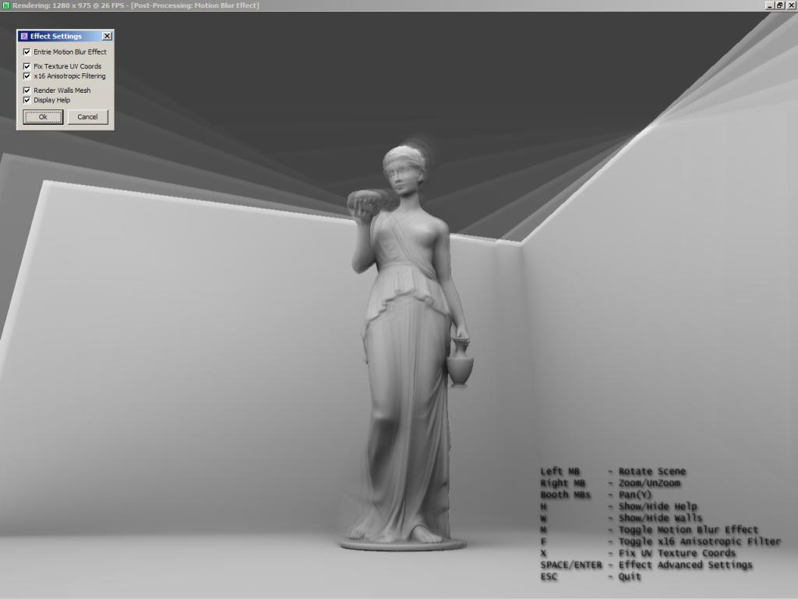



## Post\-Processing With Pixel Shaders \(Motion Blur\)

### Description

Usage of render targets and pixel shaders to create a post-processing motion blur effect. See !readMe.txt inside archive for more info.
 
### More Info
 

             |
---                |---
**Submitted On**   |2007-07-17 11:58:08
**By**             |[\[seal\] Fg](https://github.com/Planet-Source-Code/PSCIndex/blob/master/ByAuthor/seal-fg.md)
**Level**          |Advanced
**User Rating**    |5.0 (15 globes from 3 users)
**Compatibility**  |VB 6\.0
**Category**       |[DirectX](https://github.com/Planet-Source-Code/PSCIndex/blob/master/ByCategory/directx__1-44.md)
**World**          |[Visual Basic](https://github.com/Planet-Source-Code/PSCIndex/blob/master/ByWorld/visual-basic.md)
**Archive File**   |[Post\-Proce2075897172007\.zip](https://github.com/Planet-Source-Code/seal-fg-post-processing-with-pixel-shaders-motion-blur__1-69015/archive/master.zip)

